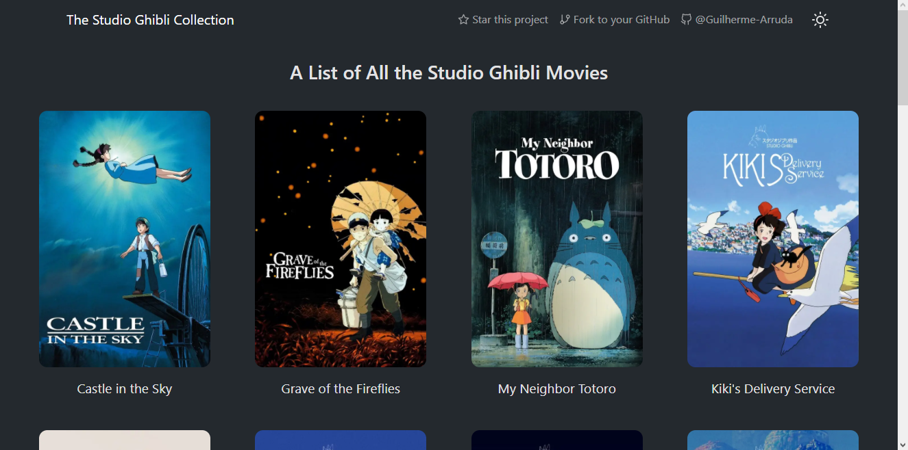
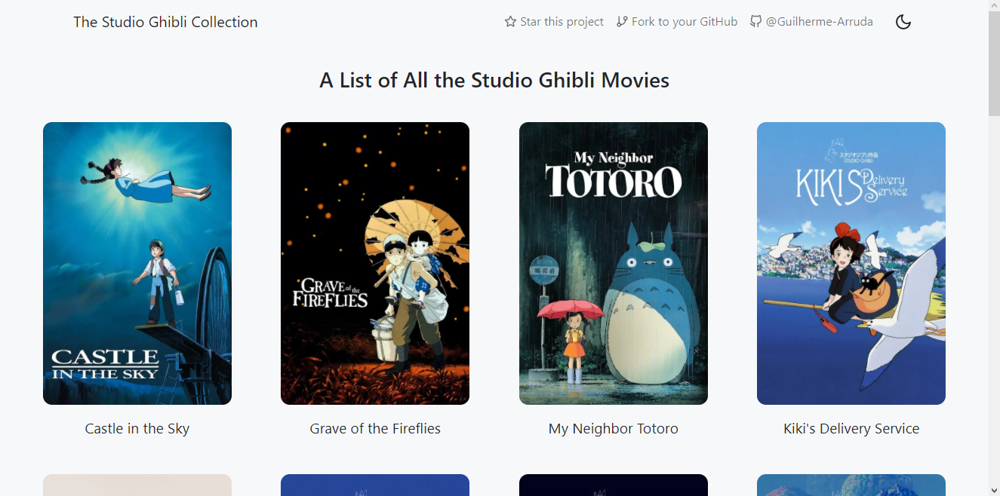
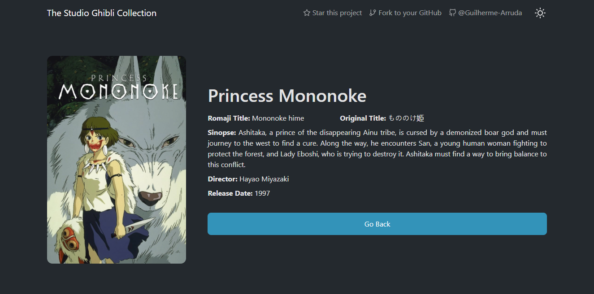
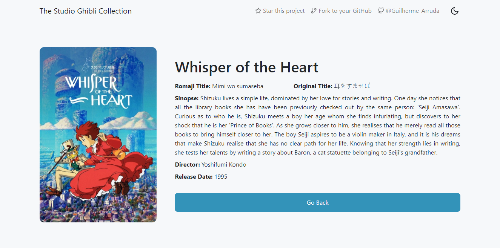
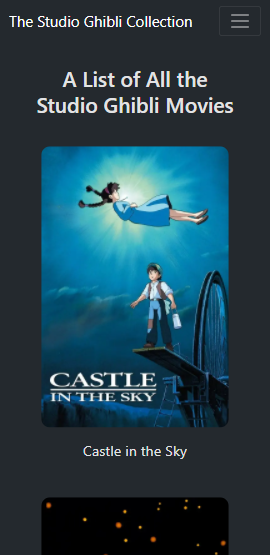
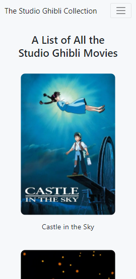
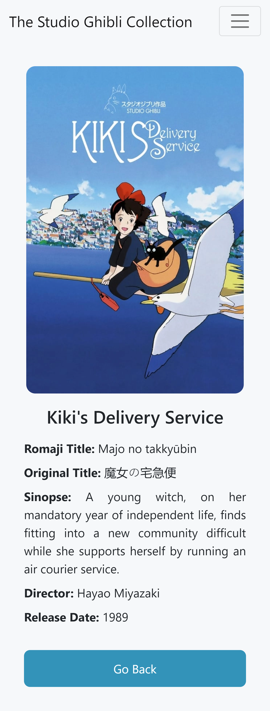

# Studio Ghibli

A web page that shows all Studio Ghibli Movies.  
You can also view details from a movie when you click on it.

## Web Version

 
  
  

 
  
  

## Mobile Version

 
  
  
  
  

## Technologies

* Next.js
* Styled Components
* Context API
* React Bootstrap
* ESLint
* Prettier

## 🤖 Demo

You can view the project demo at [https://studio-ghibli-guilherme-arruda.vercel.app](https://studio-ghibli-guilherme-arruda.vercel.app).

## 🚀 Getting Started

Clone or download it as ZIP file. Open your terminal, go to the project folder and run `npm install` or `yarn` to install all dependencies. To run the project, run `npm dev` or `yarn dev` and it'll open on localhost.

## 📄 License

This project is under MIT license - see the file [LICENSE.md](https://github.com/Guilherme-Arruda/studio-ghibli/blob/master/LICENSE) for details.

---

##### Coded with love by Guilherme Arruda ♥️
